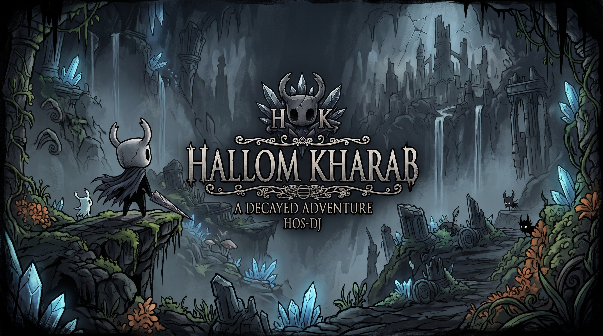

# 🗡️ Hollow Knight 2D: LibGDX Implementation

<div align="center">
  
  <br/><br/>
  
  [](https://www.java.com/)
  [](https://libgdx.com/)
  [](https://gradle.org/)
  [](#-architecture--design)
  
  <p><strong>A technically rigorous 2D action-platformer engine recreation inspired by Hollow Knight.</strong></p>
</div>

---

## 📖 About The Project

This project is a high-performance 2D game demo built from scratch using **Java** and the **LibGDX** framework. Rather than just a visual clone, this repository demonstrates robust software engineering practices, specifically focusing on the **Model-View-Controller (MVC)** architecture, efficient memory management, and decoupled game systems.

Generated initially via **GDX Liftoff**, the project is structured to scale, handling complex state machines, physics logic, and dynamic rendering pipelines.

## ✨ Core Systems & Mechanics

* 🏗️ **MVC Architecture:** Strict separation of game logic (Model), rendering (View), and input handling (Controller) to ensure maintainable and modular code.
* 🎥 **Advanced Camera System:** Custom Orthographic camera implementation featuring strict coordinate clamping mechanics to keep the viewport perfectly constrained within level boundaries.
* 🏃 **Precision Movement Controls:** Highly responsive physics controller handling acceleration, friction, jumping logic, and mid-air dashing.
* 🎞️ **Sprite Animation Loader:** A custom pipeline for parsing and managing frame-by-frame sprite sheets, dynamically switching states (Idle, Run, Jump, Dash, Attack).
* 🖥️ **UI Modals & Screen Management:** Robust screen transitions and UI modal systems (e.g., Pause Menus, Inventory stubs) overlaying the main game loop without halting the core thread unexpectedly.

---

## 📂 Project Structure

The repository follows a clean, multi-module Gradle structure standard to modern LibGDX applications:

```text
Hollow-Knight-Demo/
├── lwjgl3/                              # Desktop launcher (LWJGL 3 backend)
│   └── src/main/java/.../DesktopLauncher.java
├── core/                                # Main game logic & systems
│   └── src/main/java/com/hosdj/game/
│       ├── model/                       # Data structures, Entities, Physics State
│       ├── view/                        # Rendering loops, Sprite loaders, UI Modals
│       ├── controller/                  # Input processors, Movement controls
│       ├── screens/                     # Screen implementations (PlayScreen, MenuScreen)
│       └── managers/                    # AssetManager wrappers, Camera configuration
├── assets/                              # Resource directory
│   ├── sprites/                         # Packed texture atlases (.atlas, .png)
│   ├── maps/                            # Tiled map files (.tmx)
│   ├── ui/                              # UI skins and modal backgrounds
│   └── sounds/                          # Audio assets
└── build.gradle                         # Root GDX Liftoff Gradle build script
